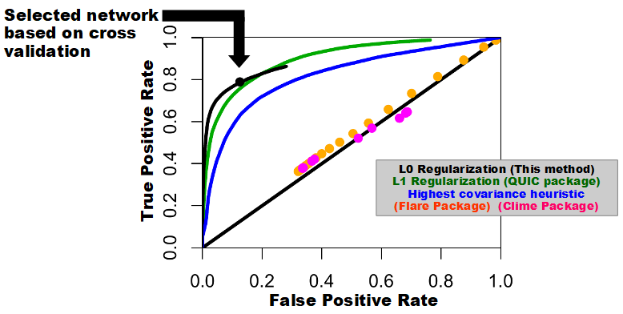
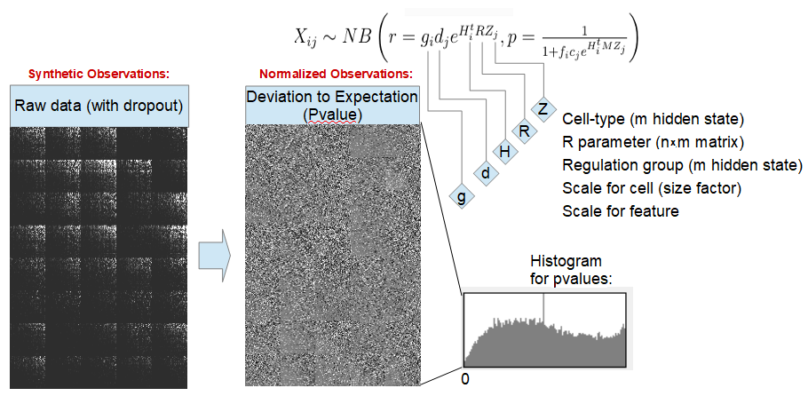
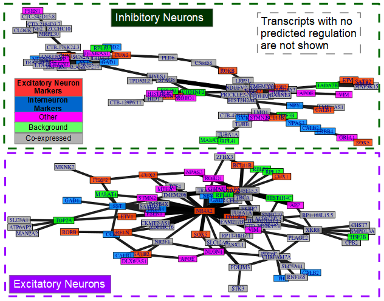

# InferN0
Inference of regulatory Network under L0 regularization

The analysis of the coexpression of genes in single cell can be used to retrieve potential regulatory elements; however, the preriquisite for this is to distinguish between intrinsic variability from either experimental varibility and/or sampling variability. This motivates the use of the L0 regulatization, as opposed to L1 or L2 regulazation, since it is capable of finding the most probable causal associations in highly sparse regulatory networks with the lowest false discovery rate:

An L0 regularization cost is not differentiable, as it explicitly penalise non-zero weight in the precision matrix (the inverse of the variance) by counting the number of such entries. This constain the search for an optimal network incremantally introduce new degree of liberty as non-zero entries, and update the precision matrix that yeild maximum likelihood. A close form solution of the update of the precision matrix exists, provided that a new added link does not create a cycle; as such, this method uses the close form solution whenever it is possible, and otherwise update the precision matrix using gradient ascent.

============
#Installation

Prerequisites:
  - gcc
  - Rpackages: Rcpp, RcppArmadillo, ggplot2

Alternatively, use provided script to install prerequisites:

  git clone https://github.com/lfhandfield/InferN0.git
  cd InferN0
  sudo sh install.sh
