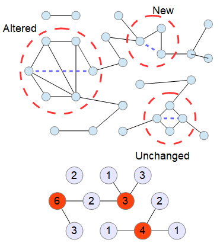
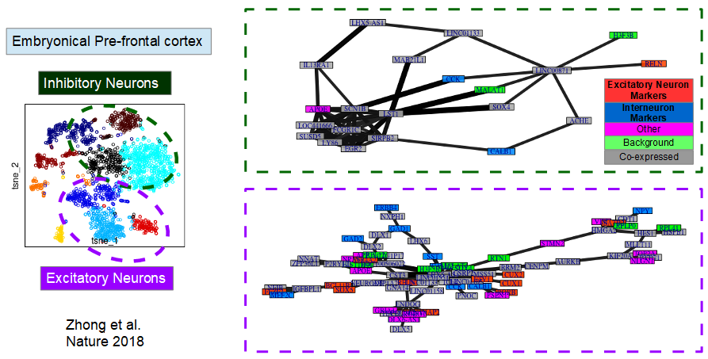

# InferN0
Inference of regulatory Network under L0 regularization

The analysis of the co-expression of genes in single cell can be used to retrieve potential regulatory elements; however, the prerequisite for this is to distinguish between intrinsic variability from either experimental variability and/or sampling variability. This motivates the use of the L0 regularization, as opposed to L1 or L2 regularization, since it is capable of finding the most probable causal associations in highly sparse regulatory networks with the lowest false discovery rate:

An L0 regularization cost is not differentiable, as it explicitly penalize non-zero weight in the precision matrix (the inverse of the variance) by counting the number of such entries. This constrain the search for an optimal network incrementally introduce new degree of liberty as non-zero entries, and update the precision matrix that yield maximum likelihood. A close form solution of the update of the precision matrix exists, provided that a new added link does not create a cycle; as such, this method uses the close form solution whenever it is possible, and otherwise update the precision matrix using gradient ascent. The greedy search require to compute the increase of likelihood granted by any addition of any new edge; as such, this optimization is key as the number of neighbor networks differing by a single link is close to the square of the number of genes considered.

The is a significant number of con funding factors that hinder the quantification of the expression of genes at the single-cell level. This approach aims to capture the effect of library size and cell type heterogeneity in order to capture co-expression that is not resulting from such confounding factors (alternatively, replicate experiments batch effect can be used instead of cell-type, provided that the number of cell is sufficient to quantify gene co-expression in single cells). Furthermore, this modeling of the expression is also required is key as significance of co-expressed gene is evaluated assuming gene expression is a multi-variate normal distribution, which is not the case and it better approximated with the Negative-binomial distribution. Deviations to the expectation are use to produce Z-scores for every gene, which allow to evaluate the covariance between any gene independently of their mean expression.

Example of regulatory network predicted from embryonical single-cell from, Zhong et al. This highlight relations that are shared in the multiple cell types, at different development stages, which as aggregated as excitatory or inhibitory cell types. This is required as the number of single-cell is low, and as quantification of co-expression is entangled with sampling variability, especially for lowly expressed genes.

Example of regulatory network predicted from Ipsc derived neurons which differentiated to two distinct end-points, where one exhibited excitatory neuron markers and the latter inhibitory markers.

